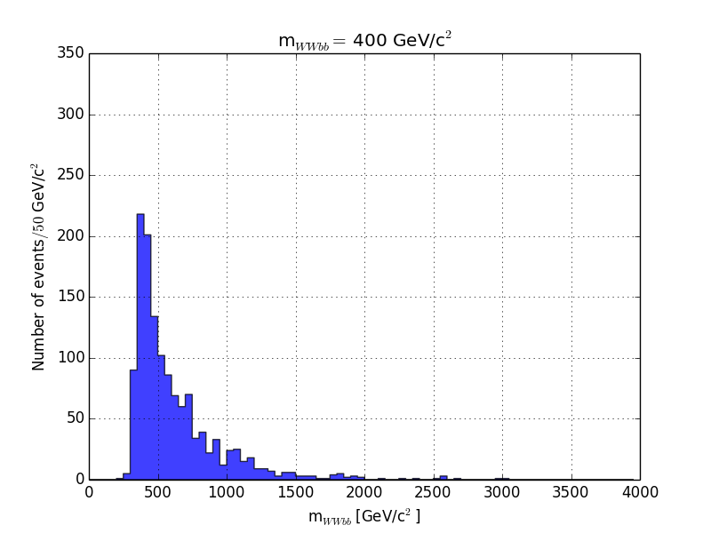
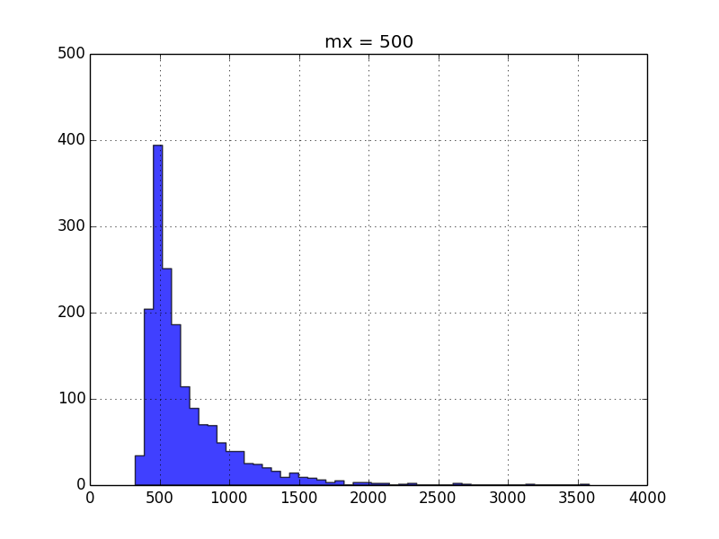
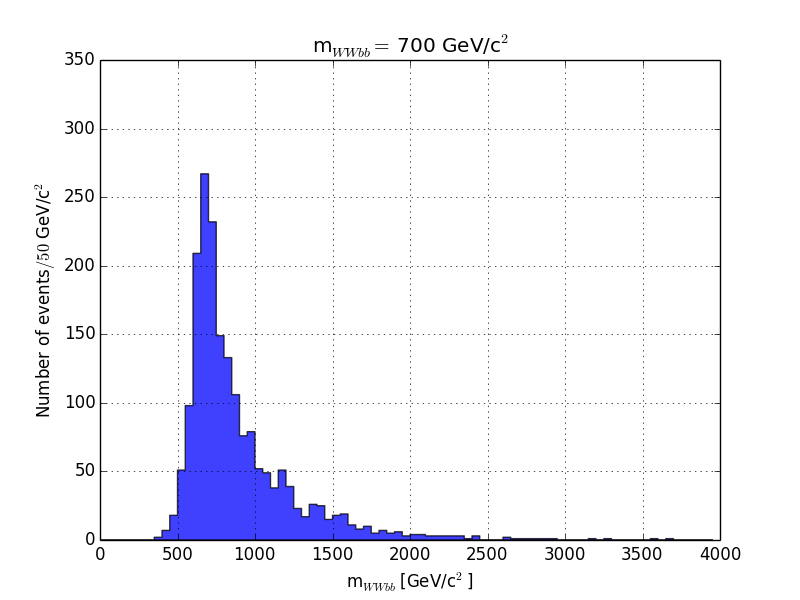
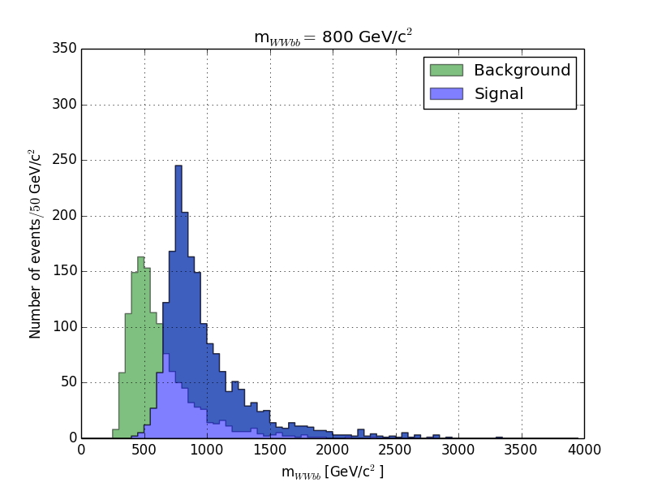
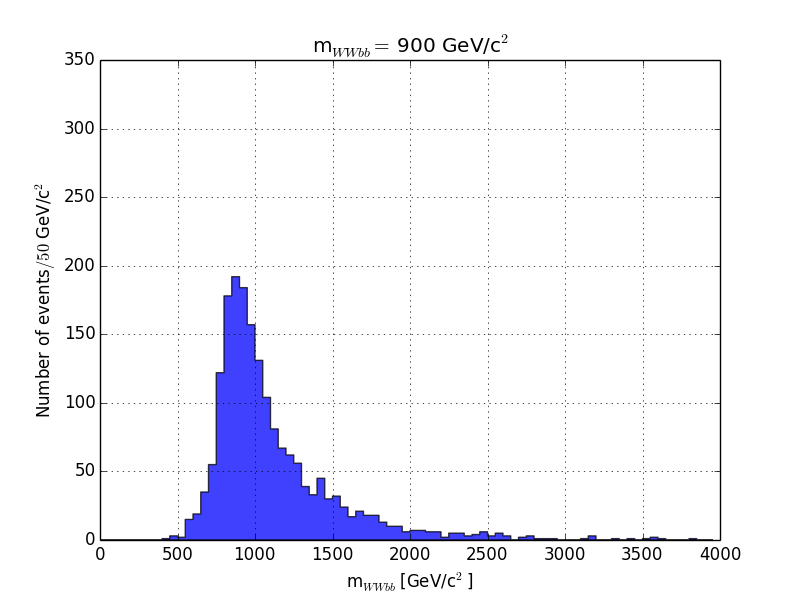
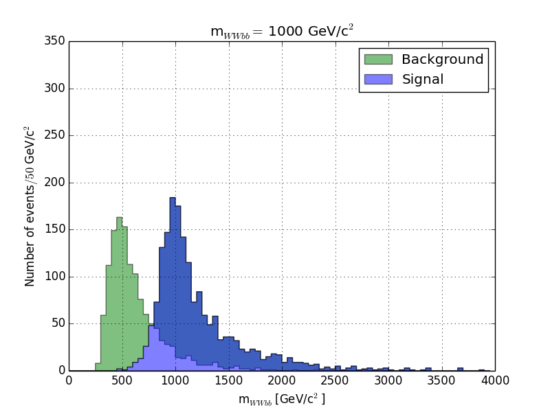
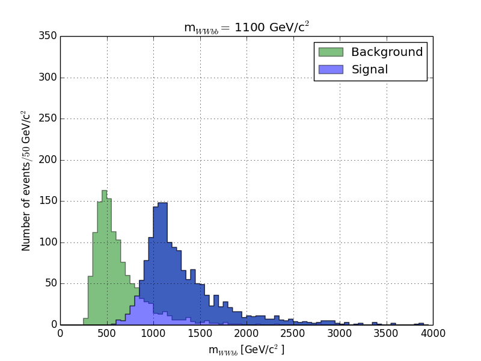
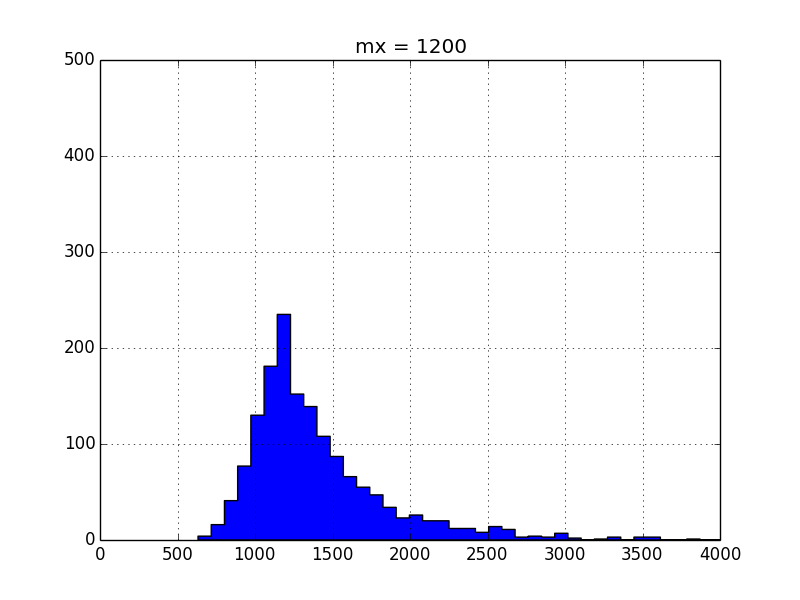
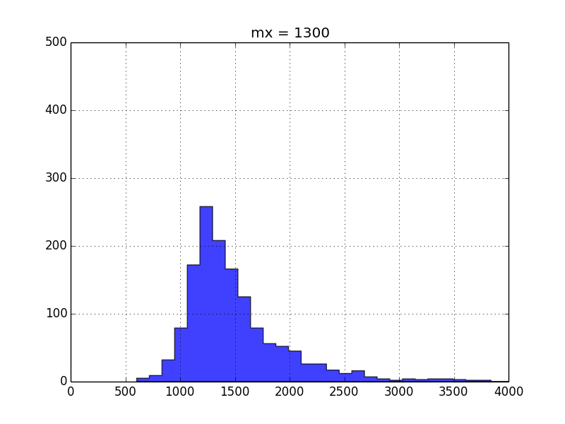
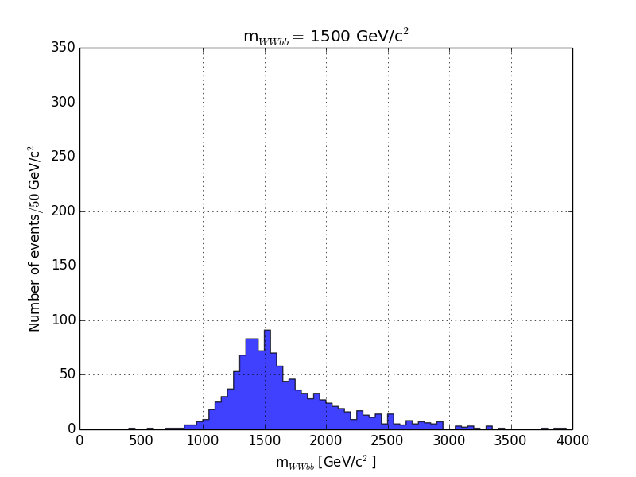

# parameterizedML

This script utilizes [Theano](http://deeplearning.net/software/theano/), [Pylearn2](http://deeplearning.net/software/pylearn2/) and alexjc's [scikit-neuralnetwork](https://github.com/aigamedev/scikit-neuralnetwork) to create a fixed and parameterized machine learning scheme. Datasets are generated for multiple signals and a uniform (i.e. flat) background. A regression neural network (NN) is used to learn for N signals at fixed means which are mapped as a 1D array to signal/background values of 1 or 0. Second, parameterized training is done for those same N signals simultaneously and then predictions are made for the signals parameterized by a secondary input (alpha).

## Gaussians on a flat background

### Fixed Training
Initially, signal is generated for a toy model of gaussians and a flat background

Theano/Pylearn2's NN learns from these inputs and maps testdata to signal/background for fixed mean values (mu=-2, -1,0, +1, +2).

### Parameterized Training
using those same sets of training gaussians

Changing the input to be parameterized in terms of a variable (alpha) such that input = (x, alpha), the NN can now train across the parameterized input such that output for untrainined mu values (e.g. mu=-1.5, -0.5, 0.5, 1.5) can interpolate from trained gaussians in those untrained regions.

## X->ttbar data

Running the same analysis on real world data

for 12 energy samples

<table style="width:100%">
  <tr>
    <td></td>
    <td></td>		
    <td></td>
  </tr>
  <tr>
    <td></td>
    <td></td>		
    <td></td>
  </tr>
  <tr>
    <td></td>
    <td></td>		
    <td></td>
  </tr>
  <tr>
    <td></td>
    <td></td>		
    <td></td>
  </tr>
</table>

### Fixed Training

### Parameterized Training
For fixed training at mu=500, 1000, 1500 

we can interpolate at energies not trained for (i.e. mu=750, 1250)

